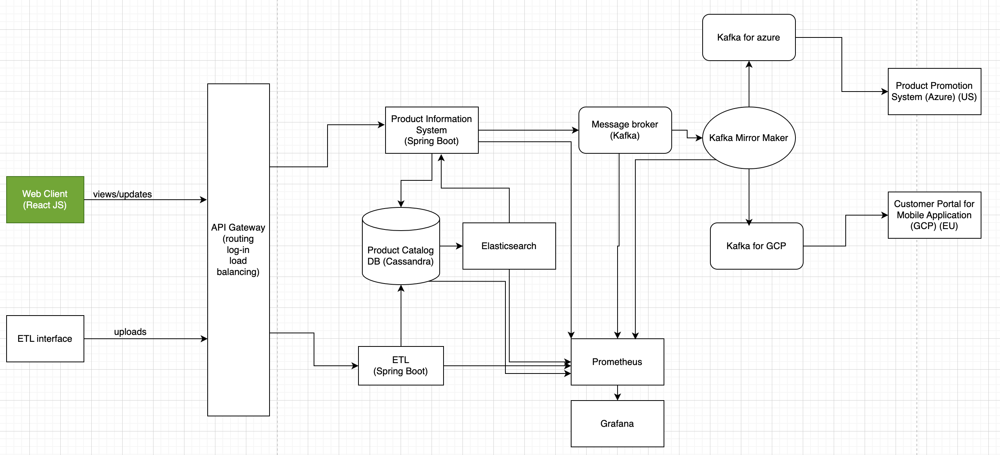
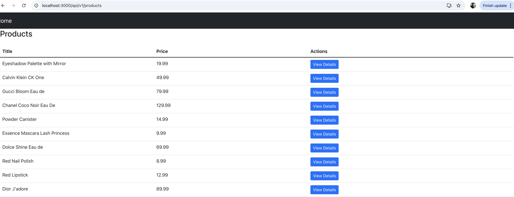
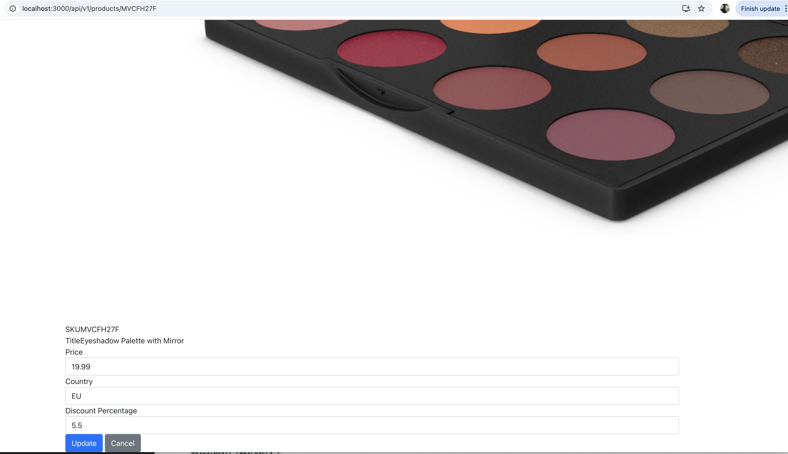

# Product Information System Frontend

Microservice for the User Interface of the product information System. 

It denotes the green part in the following :

It is react.js application, provides the UI to be able to view products and update them.

### To test & Run the application:

`npm run tests`

and then

`npm start`

can be run. 

We can also use docker to build it as such

`docker build -t product-information-system-frontend .`

and then 

`docker run -p 3000:3000 product-information-system-frontend`

### Linting 

eslint has been configured and can be run using `npm run lint`

### CI/CD

`Github actions` has been configured which currently runs the test. We can eventually add package and publish if we have further infrastructure. 

### A quick sneak peek into the application:

#### All products page - 

#### Individual product page - 

Some basic routing is also in place. 

### Improvements:
Given it is a take home assignment, there have been things which could not be covered in the timeframe and have been identified as improvements:
- While appropriate tests are added wherever necessary, we need to incorporate some `coverage` mechanism with a threshold to verify and ensure further updates do not break things and quality is never compromised.
- Linter has been added but effort should be made to reduce the `lint issues` and eventually add it to the pipeline. 
- `CSS` needs extreme improvement. 
- `Internationalization` can be considered given we have country as a very important attribute and with that language of the user might change. 

